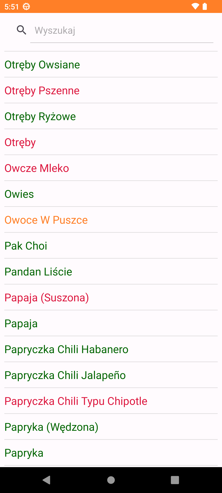
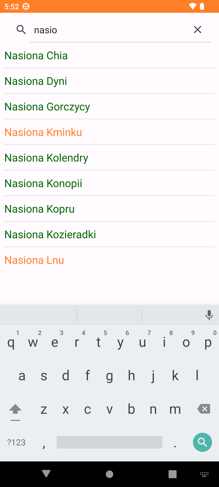

# Sibo
Ta aplikacja Java na Androida została zaprojektowana, aby pomóc osobom z przerostem bakteryjnym jelita cienkiego (SIBO) znaleźć odpowiednie pokarmy do jedzenia. Aplikacja zawiera listę produktów, które są bezpieczne dla osób z SIBO. 
# Funkcje 
* Wyświetlanie obszernej listy produktów spożywczych przyjaznych dla SIBO
* Funkcja wyszukiwania w celu szybkiego znalezienia określonych produktów
* Przyjazny dla użytkownika interfejs ułatwiający nawigację
* Produkty koloru CZERWONEGO powinny być unikane
* Produkty koloru POMARAŃCZOWEGO mogą być spożywane w małych ilościach
* Produkty koloru ZIELONEGO są dozwolone
# Zrzuty ektanu
 
# Instalacja 
Aby uruchomić tę aplikację, możesz pobrać kod źródłowy i zaimportować go do Android Studio. Upewnij się, że masz zainstalowane niezbędne narzędzia Android SDK.
# Zastosowanie
Po zainstalowaniu aplikacji otwórz ją i przejrzyj listę produktów przyjaznych dla SIBO. Użyj funkcji wyszukiwania, aby znaleźć określone elementy. 
# Pochodzenie listy
Lista produktów powstała poprzez zebranie dużego zbioru anglojęzycznych produktów diety "Low FOODMAP Diet" następnie przetłumaczona i zweryfikowana poprzez wyszukanie zdjęcia każdego z produktów.
# Zastrzeżenie
Należy pamiętać, że ta lista żywności przyjaznej dla SIBO służy wyłącznie celom informacyjnym i nie powinna zastępować profesjonalnej porady medycznej. Skonsultuj się z lekarzem lub zarejestrowanym dietetykiem przed wprowadzeniem jakichkolwiek zmian w diecie.
